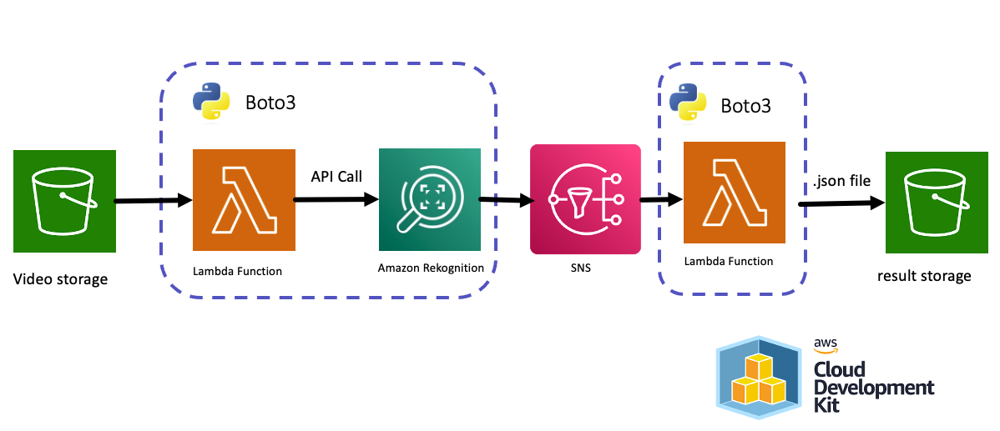
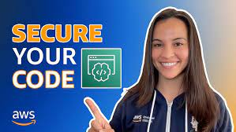
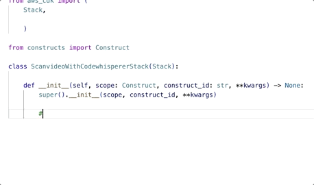
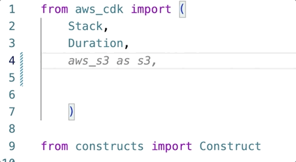
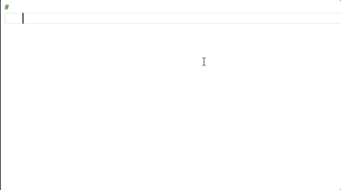

# Crea una aplicación de Video content moderation ⏯️ 🔫 🚬 en minutos usando [AWS CodeWhisperer](https://aws.amazon.com/es/pm/codewhisperer)

> Contenido original de mi blog: [All the things that Amazon Comprehend, Rekognition, Textract, Polly, Transcribe, and Others Do](https://community.aws/posts/all-the-things-that-comprehend-rekognition-textract-polly-transcribe-and-others-do)

En este repo te voy a guiar en un pao a paso en como crear una aplicación de moderación de video con [AWS Cloud Development Kit (AWS CDK)](https://docs.aws.amazon.com/cdk/v2/guide/home.html) usando [AWS CodeWhisperer](https://aws.amazon.com/es/pm/codewhisperer). 

Soy fan de las películas de acción y quería probar Rekognition con el tráiler de Die Hard 1, así que creé esta aplicación y ¡guau! cada dataframe es pura violencia 🫣... Te invito a crearla y probarla con un tráiler de tu película favorita.

 


### ¿Qué es CodeWhisperer?
Es un generador de código de uso general basado en el aprendizaje automático que le proporciona recomendaciones de código en tiempo real. A medida que escribe código, CodeWhisperer genera automáticamente sugerencias basadas en el código y los comentarios existentes. Sus recomendaciones personalizadas pueden variar en tamaño y alcance, desde un comentario de una sola línea hasta funciones completas.

CodeWhisperer también puede escanear tu código para resaltar y definir los problemas de seguridad.

## ¿Como funciona esta aplicación?

1. Sube un video en formato .mp4 a un [Bucket de S3](https://docs.aws.amazon.com/es_es/AmazonS3/latest/userguide/UsingBucket.html).
2. Una [Amazon Lambda Function](https://docs.aws.amazon.com/es_es/lambda/latest/dg/welcome.html) hace la llamada a la API de [Amazon Rekognition](https://aws.amazon.com/es/rekognition/).
3. Una vez finalizada la revisión del vídeo, una nueva función de Lambda recupera el resultado y lo almacena en un bucket de Amazon S3.

## Instrucciones para crearla con [AWS CodeWhisperer](https://aws.amazon.com/es/pm/codewhisperer): 

### Paso 1: configura [AWS CodeWhisperer](https://aws.amazon.com/es/pm/codewhisperer) en [VS Code](https://code.visualstudio.com/) para desarrolladores individuales:

Siguiendo los pasos en [Configuración de CodeWhisperer para desarrolladores individuales](https://docs.aws.amazon.com/codewhisperer/latest/userguide/whisper-setup-indv-devs.html) o ve el siguiente video: 

[](https://www.youtube.com/watch?v=sFh3_cMUrMk&t=1s)

### Paso 2: Crear El Ambiente de [AWS Cloud Development Kit (AWS CDK)](https://docs.aws.amazon.com/cdk/v2/guide/home.html): 

Siguendo los pasos de [Tu primeraAWS CDK aplicación](https://docs.aws.amazon.com/es_es/cdk/v2/guide/hello_world.html)

- Crea la carpeta para la aplicación y luego ingresa a ella: 

```
mkdir scanvideo-with-codewhisperer 
cd scanvideo-with-codewhisperer 
```

- Inicializa la aplicación en el lenguaje python: 

```
cdk init app --language python
```
- Activa en ambiente virtual e instala las dependencias de AWS CDK principales. 

```
source .venv/bin/activate
python -m pip install -r requirements.txt
```

### Paso 3: Crear La Aplicación: 

En este paso le vamos a pedir a [AWS CodeWhisperer](https://aws.amazon.com/es/pm/codewhisperer) que nos sugiera el código que dará vida a nuestra aplicación. 

 

Volviendo a la arquitectura, necesitamos crear lo siguiente: 
1. Un bucket de Amazon S3, que se llamará `video-storage`. 
2. Dos Lambdas Functions:
    - lambda_invokes_Rekognition: Para invocar la API [start_content_moderation](https://boto3.amazonaws.com/v1/documentation/api/1.9.42/reference/services/rekognition.html#Rekognition.Client.start_content_moderation) de Amazon Rekognition.
    - lambda_process_Rekognition: Para procesar el resultado de Amazon Rekognition. 
3. Un Amazon SNS Topic para generar la notificación a `lambda_process_Rekognition` cuando se termine de procesar el video. 

Para empezar a generar el codigo ve al `/scanvideo-with-codewhisperer/scanvideo_with_codewhisperer/scanvideo_with_codewhisperer_stack.py` creado en el ambiente del paso anterior. 

Escribe las siguientes instrucciones, una a una, una vez escribas la intruccion presiona `enter`, luego las teclas `option + c` y la fechas `derecha` e `izquierda` para seleccionar la sugerencia de código más adecuado. 

En este video puedes ver un ejemplo: 

[](https://www.youtube.com/watch?v=qu67bvH2Y08)

> 🚨 **Atención** Amazon CodeWhisperer te entrega sugerencias de código que no necesariamente esten 100% correctos, debes revisarlo y si es necesario modificarlo. 

1 - Crear el Amazon s3 Bucket: 

`#cdk code to amazon s3 bucket named "video-storage"`



```python
video_storage = s3.Bucket(self, "video-storage",
                                       versioned=False,
                                       removal_policy=RemovalPolicy.DESTROY,
                                       auto_delete_objects=True)
```

2 - Crear el Amazon SNS Topic: 

`#cdk code to sns topic named "scan-video-topic"`
```python
scan_video_topic = sns.Topic(self, "scan-video-topic")
```

3 - Crear el Amazon IAM Role para ejecutar Amazon Rekognition: 

`#cdk code to role to grant to assume amazon rekognition`

```python
rekognition_role = iam.Role(self, "rekognition-role",
                                    assumed_by=iam.ServicePrincipal("rekognition.amazonaws.com"))
        
```

4 - Crear agregar al Role anterior la politica que permite que Amazon Rekognition pueda publicar en el SNS Topic:

`#cdk code to add a policy to the role to allow rekognition to publish sns`

```python
rekognition_role.add_to_policy(iam.PolicyStatement(
            actions=["sns:Publish"],
            resources=[scan_video_topic.topic_arn]
        ))
```

5 - Crear la Amazon Lambda Function encargada de invocar a rekogntion (crea la carpeta `/lambdas_code/lambda_invokes_rekognition` para que sumes el código en `lambda_function.py`)

`#cdk code to create a lambda function to scan the video`
```python
scan_video_lambda = lambda_.Function(self, "lambda_invokes_Rekognition",
                                              runtime=lambda_.Runtime.PYTHON_3_8,
                                              handler="lambda_function.lambda_handler",
                                              code=lambda_.Code.from_asset("./lambdas_code/lambda_invokes_rekognition"),
                                              timeout=Duration.seconds(300),description = "Invokes Amazon Rekognition",
                                              environment={
                                                  "SNS_TOPIC_ARN": scan_video_topic.topic_arn,
                                                  "VIDEO_STORAGE_BUCKET": video_storage.bucket_name,
                                                  "REKOGNITION_ROLE_ARN": rekognition_role.role_arn
                                                  }
        )
```

6 - Permisos requeridos para lambda_invokes_rekognition Lambda Function

`#cdk code to add a permission to the lambda function to allow it to read from the video storage`

```python
video_storage.grant_read(scan_video_lambda)
```

`#cdk code to add a lambda function role policy to invoke amazon rekognition StartContentModeration`

```python
scan_video_lambda.add_to_role_policy(iam.PolicyStatement(
            actions=["rekognition:StartContentModeration", "rekognition:GetContentModeration"],
            resources=["*"]
            ))
```

`#cdk code to amazon s3 bucket event to trigger lambda function LambdaDestination`
```python
video_storage.add_event_notification(s3.EventType.OBJECT_CREATED,
                                              aws_s3_notifications.LambdaDestination(scan_video_lambda),
                                              s3.NotificationKeyFilter(prefix="videos/"))
```

`#cdk code to add a lambda function role policy passrole action to resources rekognition`

```python
scan_video_lambda.add_to_role_policy(iam.PolicyStatement(
            actions=["iam:PassRole"],
            resources=[rekognition_role.role_arn]
            ))
``` 

`#cdk code to add a lambda function role policy passrole action to resources rekognition`

```python
        scan_video_lambda.add_to_role_policy(iam.PolicyStatement(
            actions=["iam:PassRole"],
            resources=[rekognition_role.role_arn]
            ))
```

7 - Crear la Amazon Lambda Function encargada de procesar el resultado de amazon rekogntion (el código de esta se crea aparte en `/lambdas_code/lambda_process_rekognition`)

`#cdk code to create a lambda function to process result of content moderation`

```python
process_result_lambda = lambda_.Function(self, "lambda_process_rekognition",
                                                  runtime=lambda_.Runtime.PYTHON_3_8,
                                                  handler="lambda_function.lambda_handler",
                                                  timeout=Duration.seconds(300),description = "Process Amazon Rekognition ",
                                                  code=lambda_.Code.from_asset("./lambdas_code/lambda_process_rekognition"),
                                                  environment={
                                                      "BUCKET_NAME": video_storage.bucket_name
                                                      }
                                                      )
```

8 - Permisos requeridos para lambda_process_rekognition Lambda Function

`#cdk code to add a permission to the lambda function to allow it write from the video storage`

```python
video_storage.grant_write(process_result_lambda)
```

`#cdk code to add a lambda function role policy to invoke amazon rekognition GetContentModeration`

```python
process_result_lambda.add_to_role_policy(iam.PolicyStatement(
            actions=["rekognition:GetContentModeration"],
            resources=["*"]
            ))
```

`#cdk code to add a LambdaSubscription`

```python
scan_video_topic.add_subscription(subs.LambdaSubscription(process_result_lambda))
```

9 - Asegura de importar todas las librerias necesarias. 



```python
from aws_cdk import (
    Stack,
    Duration,
    RemovalPolicy,
    aws_s3 as s3,
    aws_sns as sns,
    aws_iam as iam,
    aws_lambda as lambda_,
    aws_s3_notifications,
    aws_sns_subscriptions as subs,
  )
```

Cuando finalices deberías ver algo como en [scanvideo_with_codewhisperer_stack.py](/scanvideo-with-codewhisperer/scanvideo_with_codewhisperer/scanvideo_with_codewhisperer_stack.py)


### Paso 4: Código de la Amazon Lambda Function `lambda_invokes_rekognition`: 

La puedes crear con una sola linea de solicitud:

`#python code a lambda function to start rekognition video content moderation`



```python
import boto3
import json
import os

def lambda_handler(event, context):
    print(event)
    # Get the object from the event and show its content type
    bucket = event['Records'][0]['s3']['bucket']['name']
    key = event['Records'][0]['s3']['object']['key']
    print(bucket)
    print(key)
    client = boto3.client('rekognition')
    response = client.start_content_moderation(
        Video={
            'S3Object': {
                'Bucket': bucket,
                'Name': key,
            }
        },
        NotificationChannel={
            'SNSTopicArn': os.environ['SNS_TOPIC_ARN'],
            'RoleArn': os.environ['REKOGNITION_ROLE_ARN']
        },
        JobTag='rekognition-video-content-moderation'
    )
    print(response)
    return {
        'statusCode': 200,
        'body': json.dumps('Hello from Lambda!')
    }
    
```

Aca puedes ver el código final: [lambda_invokes_rekognition/lambda_function.py](/scanvideo-with-codewhisperer/lambdas_code/lambda_invokes_rekognition/lambda_function.py)

### Paso 5: Código de la Amazon Lambda Function `lambda_process_rekognition`: 

Esta Lambda Function hace mas cosas por separado por lo que pediremos sugerencias de forma estructurada: 

`#create a function to get content moderation from jobid from rekognition`

```python
import boto3
import json
import os

def get_content_moderation(job_id, rekognition_client):
    response = rekognition_client.get_content_moderation(JobId=job_id)
    return response
```

`#upload response to s3 bucket`

```python
def upload_to_s3(bucket, key, response,s3_client):
    s3_client.put_object(bucket, key).put(Body=json.dumps(response))
    return response
```

`#get jobid from event sns message`

```python
def get_jobid(event):
    message = json.loads(event['Records'][0]['Sns']['Message'])
    return message['JobId'] 
```

`#get object name from event sns message`
```python
def get_object_name(event):
    message = json.loads(event['Records'][0]['Sns']['Message'])
    return message['Video']['S3ObjectName']
```

`#create a lambda function to get content moderation from rekognition`

```python
def lambda_handler(event, context):
    jobid = get_jobid(event)
    object_name = get_object_name(event)
    filename = object_name.replace(".mp4", ".json")
    print(jobid)
    rekognition_client = boto3.client('rekognition')
    response = get_content_moderation(jobid, rekognition_client)
    print(response)
    upload_to_s3(bucket_name, filename, response,boto3.client('s3'))
    return response
```

>👾 Recuerda sumar al código el bucket name --> `bucket_name = os.environ.get('BUCKET_NAME')`


Aca puedes ver el código final: [lambda_process_rekognition/lambda_function.py](/scanvideo-with-codewhisperer/lambdas_code/lambda_process_rekognition/lambda_function.py)

### Paso 6: Deploy y prueba!

Una vez generado el código, en el terminal ve nuevamente a la carpeta *scanvideo-with-codewhisperer*, y despliegua🚀 con: 

```
cdk deploy
```

🤖 Listo!! creaste aplicación de Moderacion de video 👨🏻⏯️ 🔫 🚬! 

Te dejo un vide para que la pruebes rápidamente --> [Video](imagenes/moderation-video.mp4)

### Paso 7: Elimina la aplicación.

Para eliminar todo lo creado anteriormente solo debes ingresar el siguiente comando: 

```
cdk destroy
```

----

# 🚨¿Te gusto? 👩🏻‍💻 ¿Tienes comentarios?🎤 cuéntamelo todo --> [acá](https://www.pulse.aws/survey/LMJI72HJ)

----

## ¡Gracias!

Te dejo mis redes: 
🇻🇪🇨🇱 [Dev.to](https://dev.to/elizabethfuentes12) [Linkedin](https://www.linkedin.com/in/lizfue/) [GitHub](https://github.com/elizabethfuentes12/) [Twitter](https://twitter.com/elizabethfue12) [Instagram](https://www.instagram.com/elifue.tech) [Youtube](https://www.youtube.com/channel/UCr0Gnc-t30m4xyrvsQpNp2Q)
[Linktr](https://linktr.ee/elizabethfuentesleone)

---

## Security

See [CONTRIBUTING](CONTRIBUTING.md#security-issue-notifications) for more information.

## License

This library is licensed under the MIT-0 License. See the LICENSE file.